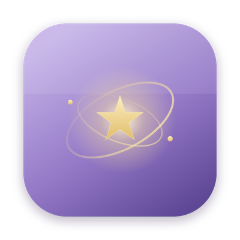

<p align="center">
  
</p>

<h1 align="center">紫微 · VibeScope · Ziwei VibeScope</h1>

> 你的 AI 编程状态岛 —— 一颗为 vibe coding 而亮的小星。
> A Dynamic Island for your AI coding agents — a little star, lit for vibe coding.

> ⚠️ macOS only. 这是一个初学者的练手 fork，基于开源的
> [Open Island (open-vibe-island)](https://github.com/Octane0411/open-vibe-island)（GPL v3）。

---

## 🇨🇳 中文

**写在前面**

我是一个 **vibe coding 的初学者**，技术很浅，这个小东西基本是我一边问 AI、一边照着学，慢慢磨出来的练手作业。

起因很简单：我在用付费的 **Vibe Island**，觉得特别好用。后来好奇 GitHub 上的 **Fork** 是什么、能不能自己也试一次，就去看了开源的 **Open Island**（[Octane0411/open-vibe-island](https://github.com/Octane0411/open-vibe-island)，GPL v3）。但我发现**开源版主要是给终端用的**，而我平时是在**桌面端的 AI 编程工具**（比如 Claude 桌面 App）里写东西——于是我就想：能不能 fork 一个**也能配合桌面端**用的版本？跌跌撞撞改着改着，就有了这个带点我自己审美的小东西。

所以它更像一份**初学者的致敬与作业**，请轻拍 🙏：

- 致敬 **Vibe Island** —— 是它让我第一次见识到「AI 编程状态岛」这么好的体验，**我支持付费，也真心建议大家去买正版**。
- 致敬 **Open Island** —— 没有它愿意开源，我这种新手根本没有上手学习的机会。

水平有限，代码里一定有很多不成熟的地方，欢迎指正、欢迎 PR，我也在学。

**为什么叫「紫微」**

「紫微」是中国星象里的帝星，紫微垣是众星环拱的天之中央。作为初学者我没什么高深技术，但很想给它一点自己喜欢的样子——把**东方星空的浪漫**放进每天的编程里：

- 🪻 **马卡龙淡紫**主色 + 暮紫夜空 + 淡金点缀，尽量克制、通透
- ⭐️ 折叠时是一颗随状态轻轻呼吸的小星，干活时身旁泛起一点**星河微光**
- 🌌 通知音用了真实**钢片琴**录音的星空叮咚，空灵不吵
- 希望你每次 vibe coding，都像**抬头看一眼星星**

**我试着改的一点东西**（边学边做，不一定完善）

- 🖥️ 让它**也能配合桌面端 AI 编程工具**用，而不只是终端
- ✅ 按规则**自动批准**，并且可**按会话一键暂停**（VPN/代理等安全拦截我特意保留、不会被绕过）
- 🎐 让灵动岛轻一点、灵动一点，配上中式星空的样子

---

## 🇬🇧 English

**A note first**

I'm a **beginner at vibe coding** with very little technical background. This little thing is basically homework — pieced together by asking AI and learning as I went.

It started simply: I use the paid **Vibe Island** and love it. Curious about what GitHub's **Fork** feature actually does, I looked at the open-source **Open Island** ([Octane0411/open-vibe-island](https://github.com/Octane0411/open-vibe-island), GPL v3). But I realized **the open-source version is mainly for the terminal**, while I do my coding inside a **desktop AI coding app** (like the Claude desktop app). So I wondered: could I fork one that **also works with desktop tools**? Fumbling along, this little version — with a bit of my own taste — came out.

So please read it as **a beginner's tribute and homework**, and go easy on me 🙏:

- To **Vibe Island** — it gave me my first taste of how good a "status island for AI coding" can be. **I support paying for it, and I honestly recommend buying the original.**
- To **Open Island** — without its open source, a newbie like me would never have had anything to learn from.

My skills are limited and the code surely has rough edges — corrections and PRs are very welcome. I'm still learning.

**Why "Ziwei" (紫微)**

*Ziwei* is the **Emperor Star** (the celestial pole) in Chinese astronomy — the still center the heavens turn around. I'm no expert, but I wanted to give it a look I love: a bit of **Eastern starlit romance** in everyday coding.

- 🪻 **Macaron purple** palette, a dusk-violet sky, soft-gold accents — kept restrained and airy
- ⭐️ Collapsed, it's a little star that breathes with your agent's state; working, a faint **galaxy shimmer** rises beside it
- 🌌 Notifications chime on a real **celesta** recording — ethereal, never noisy
- May every vibe-coding session feel a little like **looking up at the stars**

**What I tried to change** (learning as I go, far from perfect)

- 🖥️ Made it **work with desktop AI coding apps too**, not just the terminal
- ✅ **Rule-based auto-approve**, with **per-session one-tap pause** (safety rails like VPN/proxy protection are deliberately kept and never bypassed)
- 🎐 A lighter, livelier island dressed in a Chinese starry-sky aesthetic

---

## 🛠 构建 / Build

需要 macOS + Swift 6 工具链（[swift.org](https://www.swift.org/install/macos/)）。
Requires macOS and a Swift 6 toolchain from [swift.org](https://www.swift.org/install/macos/).

```bash
swift build
zsh scripts/launch-dev-app.sh --skip-setup
```

更完整的说明请参考上游 **Open Island**。
For fuller documentation, please see upstream **Open Island**.

## 🙏 致谢 / Credits

- **Vibe Island** — 原创的付费状态岛，请支持正版 / the original paid status island; please support it.
- **[Open Island / open-vibe-island](https://github.com/Octane0411/open-vibe-island)** — 本项目 fork 自此开源项目 / this project is forked from it.
- 提示音改编自 Wikimedia Commons 的钢片琴公共领域录音（柴可夫斯基《糖梅仙子》片段）/ notification chime adapted from a public-domain celesta recording on Wikimedia Commons (excerpt from Tchaikovsky's *Dance of the Sugar Plum Fairy*).

## 📄 License

GPL v3，继承自上游 Open Island。原作者版权与署名全部保留。
GPL v3, inherited from upstream Open Island. All original copyright and attribution are retained.
